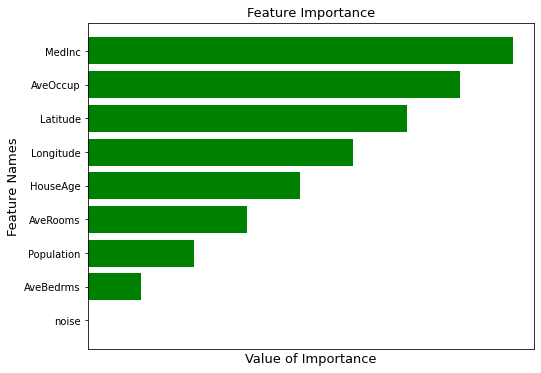

<h1><center>Feature Importance</center></h1>

<h2><center>By Alex Bradshaw</center></h2>


# 1. Introduction
   Feature importance is how important our features are (duh), but what does that really mean and why does it matter? Specifically, it means what features actually have significant power predicting our target variable. If a red ball bounced more than a blue ball, would we conclude red balls generally bounce higher than blue ones? Maybe for this example but it doesn't generalize well, and it's more important to generalize well than to be correct for any specific situation. In the real world, we would add as many features as possible at first into a model, and then select which ones generalize the best for unknown data. 

## 2. Adding "Noise"
My personal favorite feature importance method is by adding random noise. This technique is usually best used in random forest models since its feature importance attribute isn't inherently meaniningful. The idea behind this method is that the noise feature will get assigned some feature importance value. Since it's literally random mumbo jumbo, we know that it should not predict very well at all. Therefore anything given an importance value less than it we should exclude. Here's an example:


```python
import numpy as np
import pandas as pd
import matplotlib.pyplot as plt
import sklearn.datasets as sk
from sklearn.model_selection import train_test_split
from sklearn.ensemble import RandomForestRegressor
from sklearn.metrics import mean_squared_error
from scipy import stats
import statsmodels.formula.api as smf
```


```python
def run_forest_run(X, y, rf=RandomForestRegressor(random_state=13)):
    X_train, X_test, y_train, y_test = train_test_split(X, y, test_size=0.1, random_state=13)
    X_train['noise'] = np.random.choice(np.arange(10), size = len(X_train))
    rf.fit(X_train, y_train)
    arr = [(rf.feature_names_in_[x], rf.feature_importances_[x]) for x in range(len(rf.feature_importances_))]
    feats = np.array(sorted(arr, key=lambda x: x[1], reverse=True))
    return feats
```


```python
X, y = sk.fetch_california_housing(as_frame=True, return_X_y=True)
X
```


<table border="1" class="dataframe">
  <thead>
    <tr style="text-align: right;">
      <th></th>
      <th>MedInc</th>
      <th>HouseAge</th>
      <th>AveRooms</th>
      <th>AveBedrms</th>
      <th>Population</th>
      <th>AveOccup</th>
      <th>Latitude</th>
      <th>Longitude</th>
    </tr>
  </thead>
  <tbody>
    <tr>
      <th>0</th>
      <td>8.3252</td>
      <td>41.0</td>
      <td>6.984127</td>
      <td>1.023810</td>
      <td>322.0</td>
      <td>2.555556</td>
      <td>37.88</td>
      <td>-122.23</td>
    </tr>
    <tr>
      <th>1</th>
      <td>8.3014</td>
      <td>21.0</td>
      <td>6.238137</td>
      <td>0.971880</td>
      <td>2401.0</td>
      <td>2.109842</td>
      <td>37.86</td>
      <td>-122.22</td>
    </tr>
    <tr>
      <th>2</th>
      <td>7.2574</td>
      <td>52.0</td>
      <td>8.288136</td>
      <td>1.073446</td>
      <td>496.0</td>
      <td>2.802260</td>
      <td>37.85</td>
      <td>-122.24</td>
    </tr>
    <tr>
      <th>3</th>
      <td>5.6431</td>
      <td>52.0</td>
      <td>5.817352</td>
      <td>1.073059</td>
      <td>558.0</td>
      <td>2.547945</td>
      <td>37.85</td>
      <td>-122.25</td>
    </tr>
    <tr>
      <th>4</th>
      <td>3.8462</td>
      <td>52.0</td>
      <td>6.281853</td>
      <td>1.081081</td>
      <td>565.0</td>
      <td>2.181467</td>
      <td>37.85</td>
      <td>-122.25</td>
    </tr>
    <tr>
      <th>...</th>
      <td>...</td>
      <td>...</td>
      <td>...</td>
      <td>...</td>
      <td>...</td>
      <td>...</td>
      <td>...</td>
      <td>...</td>
    </tr>
    <tr>
      <th>20635</th>
      <td>1.5603</td>
      <td>25.0</td>
      <td>5.045455</td>
      <td>1.133333</td>
      <td>845.0</td>
      <td>2.560606</td>
      <td>39.48</td>
      <td>-121.09</td>
    </tr>
    <tr>
      <th>20636</th>
      <td>2.5568</td>
      <td>18.0</td>
      <td>6.114035</td>
      <td>1.315789</td>
      <td>356.0</td>
      <td>3.122807</td>
      <td>39.49</td>
      <td>-121.21</td>
    </tr>
    <tr>
      <th>20637</th>
      <td>1.7000</td>
      <td>17.0</td>
      <td>5.205543</td>
      <td>1.120092</td>
      <td>1007.0</td>
      <td>2.325635</td>
      <td>39.43</td>
      <td>-121.22</td>
    </tr>
    <tr>
      <th>20638</th>
      <td>1.8672</td>
      <td>18.0</td>
      <td>5.329513</td>
      <td>1.171920</td>
      <td>741.0</td>
      <td>2.123209</td>
      <td>39.43</td>
      <td>-121.32</td>
    </tr>
    <tr>
      <th>20639</th>
      <td>2.3886</td>
      <td>16.0</td>
      <td>5.254717</td>
      <td>1.162264</td>
      <td>1387.0</td>
      <td>2.616981</td>
      <td>39.37</td>
      <td>-121.24</td>
    </tr>
  </tbody>
</table>
<p>20640 rows × 8 columns</p>
</div>


```python
feats = run_forest_run(X, y)
names = list(feats[:, 0])
names.reverse()
plt.figure(figsize=(8, 6))
plt.barh(names, feats[:, 1], color = 'green')
plt.xticks([])
plt.title('Feature Importance', size=13)
plt.xlabel('Value of Importance', size=13)
plt.ylabel('Feature Names', size=13)
plt.show()
```


    

    


### Summary:
As we can see here, most of our values did better than random noise but that's not always the case. In the event our data is absolutely atrocious, noise has a possibility to be our highest predictor. In reality that usually isn't the case but it theorhetically could happen. 

What about the values that do slightly better than noise? We can concretely say values that did worse than randomly picking are not good at predicting, but where do we draw the line between bad and good? Well we can just try a different feature importance method and see if it lines up.

## 3 Feature Permutation
This is my next favorite feature importance method because it's really easy to implement and understand. We run a regression with each column and our target variable, and then do it again with our feature indices shuffled. The theory behind it is that if the feature is important, shuffling around its data will vastly ruin the results. Vice versa, if a feature is not very important, shuffling its data around may not change the result much. It's important to use a good metric or model here that captures the relationship between your features and your target variable. For example, using mean absolute error with values on very different scales may lead to some incorrect conclusions. To avoid this I simply standardized both sides. Here is a sample implementation below.


```python
feats = []
y_std = stats.zscore(y)
for c in X.columns:
    X_std = stats.zscore(X[c])
    mse = mean_squared_error(X_std, y_std)
    mse_shuffled = mean_squared_error(X_std.sample(frac=1, random_state=171), y_std)
    feats.append([c, mse, mse_shuffled, mse_shuffled-mse])
print('Features Ranked by Drop in MSE:\n')
for c in sorted(feats, key=(lambda x: x[3]), reverse=True):
    print(f'Feature: {c[0]}')
    print(f'Original MSE: {c[1]}')
    print(f'Shuffled MSE: {c[2]}\n')
```

    Features Ranked by Drop in MSE:
    
    Feature: MedInc
    Original MSE: 0.623849584082904
    Shuffled MSE: 1.9978189555233081
    
    Feature: AveRooms
    Original MSE: 1.6961034205170844
    Shuffled MSE: 1.9776063713524719
    
    Feature: HouseAge
    Original MSE: 1.7887531750135799
    Shuffled MSE: 1.9957984013922356
    
    Feature: AveOccup
    Original MSE: 2.0474748259122686
    Shuffled MSE: 2.011435022622182
    
    Feature: Population
    Original MSE: 2.0492993577777896
    Shuffled MSE: 2.0106582610717116
    
    Feature: Longitude
    Original MSE: 2.0919332302359566
    Shuffled MSE: 2.01641903994245
    
    Feature: AveBedrms
    Original MSE: 2.093401025938974
    Shuffled MSE: 1.9895411428871816
    
    Feature: Latitude
    Original MSE: 2.2883205537493185
    Shuffled MSE: 1.982975541345169
    


### Summary:
According to this list, we have some features that are not as important as we thought and now we have some features that did better when we shuffled around their indices. This would imply they're not very important or we just got unlucky and the indices created a fictional correlation. Aside from MedInc, its not clear how much (if any) significance the other features have in predicting our target or more importantly, we're not sure which features we should use as a final model to predit our target variable. 

## 4 Linear Regression p-values


Another method of feature importance is very simply, looking at the p-values when doing a linear regression. The way I like to think about p-values is the probability that the corresponding variable is not significant. This is because it's calculated using a t-test which compares the sum of squared residuals when the coefficient of the feature is zero versus it being non-zero. The typical p-value border is 0.05. If something has a p-value below 0.05, it's significant and if its above its not. Here's an example with our data:


```python
string = ''
for c in X.columns:
    string += c + '+'
string = string[:-1]
Xy = X.copy()
Xy['target'] = y
lr = smf.ols(f'target ~ {string}', data=Xy).fit()
Xy.drop('target', axis=1, inplace=True)
lr.summary()
```


<table class="simpletable">
<caption>OLS Regression Results</caption>
<tr>
  <th>Dep. Variable:</th>         <td>target</td>      <th>  R-squared:         </th> <td>   0.606</td> 
</tr>
<tr>
  <th>Model:</th>                   <td>OLS</td>       <th>  Adj. R-squared:    </th> <td>   0.606</td> 
</tr>
<tr>
  <th>Method:</th>             <td>Least Squares</td>  <th>  F-statistic:       </th> <td>   3970.</td> 
</tr>
<tr>
  <th>Date:</th>             <td>Thu, 09 Mar 2023</td> <th>  Prob (F-statistic):</th>  <td>  0.00</td>  
</tr>
<tr>
  <th>Time:</th>                 <td>18:20:44</td>     <th>  Log-Likelihood:    </th> <td> -22624.</td> 
</tr>
<tr>
  <th>No. Observations:</th>      <td> 20640</td>      <th>  AIC:               </th> <td>4.527e+04</td>
</tr>
<tr>
  <th>Df Residuals:</th>          <td> 20631</td>      <th>  BIC:               </th> <td>4.534e+04</td>
</tr>
<tr>
  <th>Df Model:</th>              <td>     8</td>      <th>                     </th>     <td> </td>    
</tr>
<tr>
  <th>Covariance Type:</th>      <td>nonrobust</td>    <th>                     </th>     <td> </td>    
</tr>
</table>
<table class="simpletable">
<tr>
       <td></td>         <th>coef</th>     <th>std err</th>      <th>t</th>      <th>P>|t|</th>  <th>[0.025</th>    <th>0.975]</th>  
</tr>
<tr>
  <th>Intercept</th>  <td>  -36.9419</td> <td>    0.659</td> <td>  -56.067</td> <td> 0.000</td> <td>  -38.233</td> <td>  -35.650</td>
</tr>
<tr>
  <th>MedInc</th>     <td>    0.4367</td> <td>    0.004</td> <td>  104.054</td> <td> 0.000</td> <td>    0.428</td> <td>    0.445</td>
</tr>
<tr>
  <th>HouseAge</th>   <td>    0.0094</td> <td>    0.000</td> <td>   21.143</td> <td> 0.000</td> <td>    0.009</td> <td>    0.010</td>
</tr>
<tr>
  <th>AveRooms</th>   <td>   -0.1073</td> <td>    0.006</td> <td>  -18.235</td> <td> 0.000</td> <td>   -0.119</td> <td>   -0.096</td>
</tr>
<tr>
  <th>AveBedrms</th>  <td>    0.6451</td> <td>    0.028</td> <td>   22.928</td> <td> 0.000</td> <td>    0.590</td> <td>    0.700</td>
</tr>
<tr>
  <th>Population</th> <td>-3.976e-06</td> <td> 4.75e-06</td> <td>   -0.837</td> <td> 0.402</td> <td>-1.33e-05</td> <td> 5.33e-06</td>
</tr>
<tr>
  <th>AveOccup</th>   <td>   -0.0038</td> <td>    0.000</td> <td>   -7.769</td> <td> 0.000</td> <td>   -0.005</td> <td>   -0.003</td>
</tr>
<tr>
  <th>Latitude</th>   <td>   -0.4213</td> <td>    0.007</td> <td>  -58.541</td> <td> 0.000</td> <td>   -0.435</td> <td>   -0.407</td>
</tr>
<tr>
  <th>Longitude</th>  <td>   -0.4345</td> <td>    0.008</td> <td>  -57.682</td> <td> 0.000</td> <td>   -0.449</td> <td>   -0.420</td>
</tr>
</table>
<table class="simpletable">
<tr>
  <th>Omnibus:</th>       <td>4393.650</td> <th>  Durbin-Watson:     </th> <td>   0.885</td> 
</tr>
<tr>
  <th>Prob(Omnibus):</th>  <td> 0.000</td>  <th>  Jarque-Bera (JB):  </th> <td>14087.596</td>
</tr>
<tr>
  <th>Skew:</th>           <td> 1.082</td>  <th>  Prob(JB):          </th> <td>    0.00</td> 
</tr>
<tr>
  <th>Kurtosis:</th>       <td> 6.420</td>  <th>  Cond. No.          </th> <td>2.38e+05</td> 
</tr>
</table><br/><br/>Notes:<br/>[1] Standard Errors assume that the covariance matrix of the errors is correctly specified.<br/>[2] The condition number is large, 2.38e+05. This might indicate that there are<br/>strong multicollinearity or other numerical problems.


In our linear regression model summary, it tells us that in fact all of our variables are significant except for Population. This adds up with our initial feature selection methods because Population is always at the bottom and MedInc is always at the top.

## 5 Summary
Although there definitely is more ways to find important features, these are three quick and easy methods to find which features significantly predict unseen data accurately. The reason there might be some variation from method to method or why some features may not seem as important as you think they should be using domain knowledge for instance, is because the data might be missing important features or two or more features are highly correlated which might bring both of their individual importances down even though they may both be important. Fixing this would be more of a feature engineering issue than feature importance which is why I did not cover it in this notebook. Overall, it's impossible to know the ground truth of feature combinations that actually make up our data so using different methods of feature importance is important to learn more about our data and use that information to make the best model that will predict unseen data.

